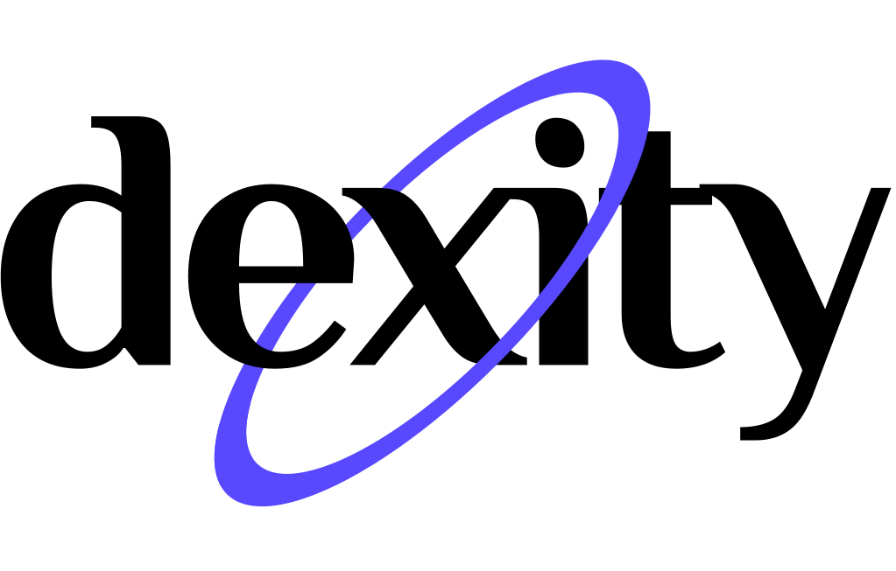

  

Программа решает следующие задачи:
---
- Распознаёт основные формы(Можно увидеть примеры, показанные на слайде)
- Находит некорректно названные и некорректно размещенные документы.(Пример на слайде)
- Меняет название документа(Внутри реализована функция, которая меняет названия в соответствии с типом документа)
- Размещает на сервере через REST API(Производится отправка на сервер с помощью API и POST запроса)
- 100 % соответствует корректность определения места хранения созданного документа в досье(Исходя из того, что алгоритм ищет совпадение слов 
- Возможна настройка гибкой системы поиска атрибутов документа и критериев распознавания

### Запуск решения
1. Установите Python 3.8 и выше
2. Установите [Tesseract-OCR](https://github.com/tesseract-ocr/tesseract)
3. Загрузите необходимые библиотеки через утилиту pip `pithon3 -m pip install Pillow flask pytesseract minecart pycurl transliterate PyMuPDF`
4. Запустите сервер `python3 main.py`

### Документация

Отправка файла на сервер

    send_file(path, ident=None, inn=None)
        Получает код ответа и json с ответом
        return: (int, json)

Классификация категории файла

    classify(file, path)
        Возвращает группу, к которой относится файл
        return: str

Основная главная страница

    index()
        Выгружает index.html на сайт, здесь 
            содержатся основные алгоримы
        return: Template

Страница с введением пути

    path_page()
        Выгружает path.html на сайт
        return: Template

Страница с результатом
    
    result_page()
        Выгружает result.html на сайт
        return: Template

Проход по всем файлам в папке
    
    check_files(path=None)
        Проходится по всем файлам в дирректории
        return: None
